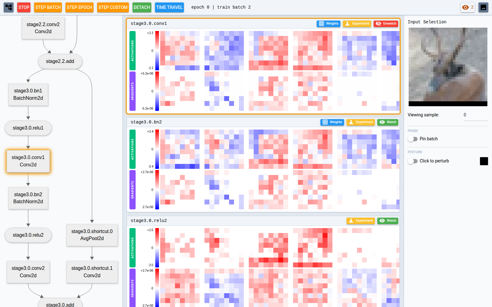
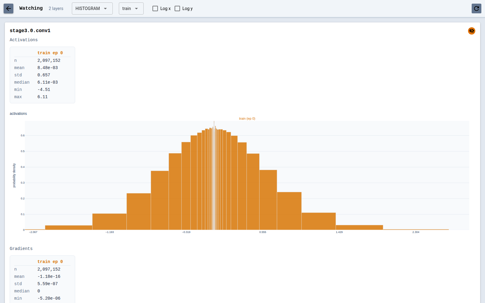
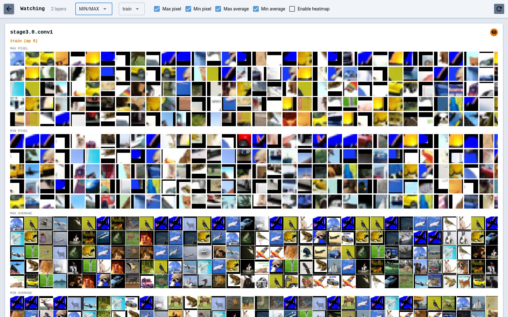
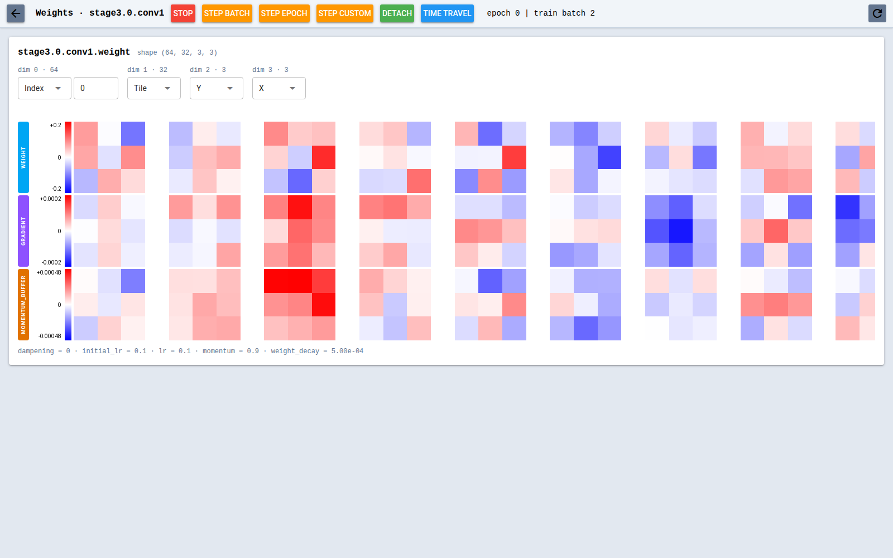
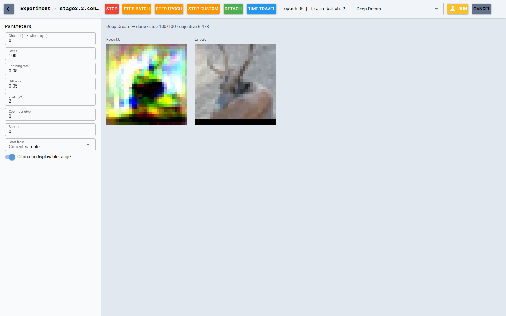

# playgrad

A visualization library for deep learning experiments: hook a `Session` into
your PyTorch training loop and inspect activations, gradients, weights, and
more from a web UI — pausing, stepping, and time-traveling the loop as it
runs. See `INTERNALS.md` for how it works under the hood.

## Running

```bash
uv sync
uv run python -m examples.vision.main --playgrad-port 8080
```

Open `http://localhost:8080`. Training pauses on the first batch; drive it
from the top bar (step batch / epoch / custom, detach, time travel).

Available examples:

- `examples.mnist_linear.main` — a single linear layer on MNIST with the
  minimal playgrad wiring (no scheduler, no time travel).
- `examples.mnist_lenet.main` — LeNet-5 on MNIST: SGD + momentum, basic
  augmentation, and the full wiring (scheduler, time travel, checkpoints).
- `examples.vision.main` — a small pre-activation ResNet (default) or a
  simple ViT (`--model vit`) on CIFAR10 (default) or Imagenette
  (`--dataset imagenette`), trained with AdamW + a cosine schedule.

## Minimal example

```python
import playgrad

session = playgrad.start(
    model,
    epochs=10,
    phases={"train": len(train_loader)},
    port=8080,
)

for epoch in range(10):
    for batch in session.batches(train_loader, phase="train", epoch=epoch):
        ...  # forward / backward / optimizer step

session.close()  # UI keeps serving the last snapshot
```

## Full example

With an optimizer (weights page shows optimizer state and the live learning
rate), a scheduler (time-travel jumps restore the LR schedule), input
denormalization for display, and time travel:

```python
from pathlib import Path

import playgrad

session = playgrad.start(
    model,
    epochs=50,
    phases={"train": len(train_loader), "val": len(val_loader)},
    optimizer=optimizer,
    scheduler=scheduler,
    port=8080,
    input_mean=(0.4914, 0.4822, 0.4465),
    input_std=(0.2470, 0.2435, 0.2616),
)

# Time travel: every epoch start is checkpointed to cache_dir. A jump from
# the UI re-enters the loop at the chosen epoch with model / optimizer /
# scheduler / RNG state restored, so the replay is deterministic.
restorer = session.training_restorer(cache_dir=Path("models/latest"))
while restorer.pending():
    with restorer:
        best_acc = 0.0  # history-dependent state goes inside: a jump resets it
        for epoch in restorer.epochs():
            for batch in session.batches(train_loader, phase="train", epoch=epoch):
                optimizer.zero_grad()
                loss = criterion(model(batch[0]), batch[1])
                loss.backward()
                optimizer.step()
            for batch in session.batches(val_loader, phase="val", epoch=epoch):
                ...  # evaluation
            scheduler.step()

session.close()
```

`enabled=False` on `playgrad.start()` turns the whole thing into a
near-zero-overhead no-op, so the wiring can stay in place for plain training
runs. The runnable version of this loop is `examples/vision/main.py`.

## Views

### Main view

The landing page. The top bar drives the training loop: stop, step batch /
epoch / custom, detach (run without pauses), and time travel (jump back to
any checkpointed epoch). The left pane shows the architecture as a diagram,
two-way linked with the center pane's layer cards: one card per layer, with
activation and gradient strips for the selected sample. Clicking a diagram
node or a card scrolls the other pane to the matching element.

The right "Input Selection" pane shows the input image and sample picker.
"Pin batch" freezes the current batch as a probe input that is re-run on
every pause, so activation changes are attributable to training rather than
to the batch changing. "Click to perturb" paints pixels onto the input;
"Compare with original" then shows per-layer activation diffs, tracing how
far the edit propagates (the receptive field).



### Watch

Toggling "Watch" on layer cards marks layers for the deep-dive `/watch`
page, which renders one card per watched layer. The HISTOGRAM view shows
activation and activation-gradient distributions over the most recent epoch
as signed-log histograms with a stats table (`n`, `mean`, `std`, `median`,
`min`/`max`); a phase dropdown switches between train/val, and Log x / Log y
checkboxes handle distributions spanning many decades.



The MIN/MAX view shows the input patches that drove the layer's most extreme
activations: per channel, the top input crops around the largest/smallest
spatial activation and whole inputs ranked by spatial mean, with an optional
activation-heatmap overlay.



### Weights

Each parameterized layer card has a "Weights" button opening
`/weights?layer=...`. It renders one panel per parameter: the weight strip
with its gradient strip below, plus — when an `optimizer=` was passed to
`start()` — one strip per tensor-valued optimizer state entry (momentum
buffer, Adam moments, …) and the param group's live hyperparameters.
Per-dimension selects remap which tensor axes become X, Y, and tiling (a 4D
conv weight defaults to kernel tiles); a Refresh button re-reads weights on
demand, even mid-training.



### Experiment

Each layer card's "Experiment" button opens `/experiment?layer=...`, which
runs per-layer experiments on the paused training thread without side
effects on training or time-travel determinism. Deep Dream runs gradient
ascent on a channel's mean activation over a batch of inputs — by default
fresh noise shaped like the network's real input, different on every Run —
with configurable regularizers, streaming the evolving images live. Four
Captum attribution methods — Grad-CAM, Neuron Gradient, Neuron Integrated
Gradients, and Occlusion — render attributions next to the input sample
they explain.



## Tests

```bash
uv run pytest
uv run ty check
```
