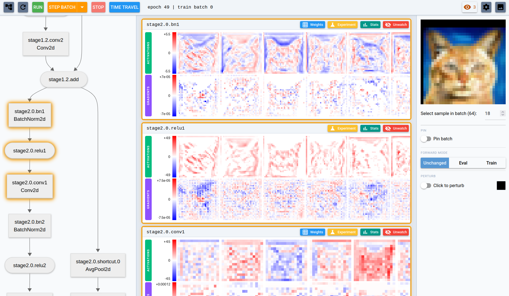
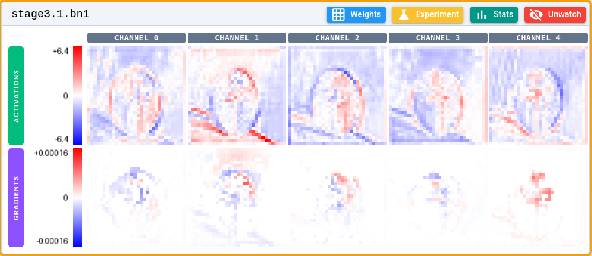
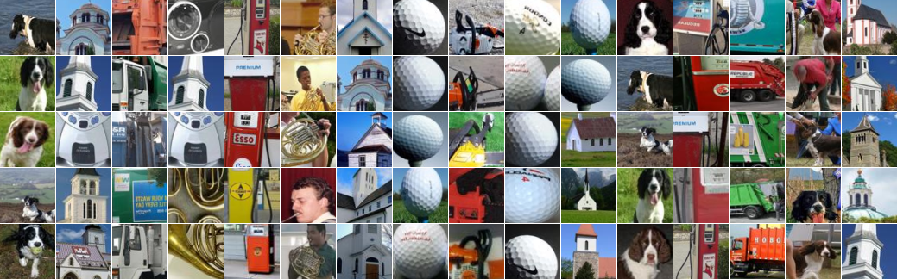
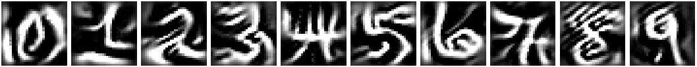
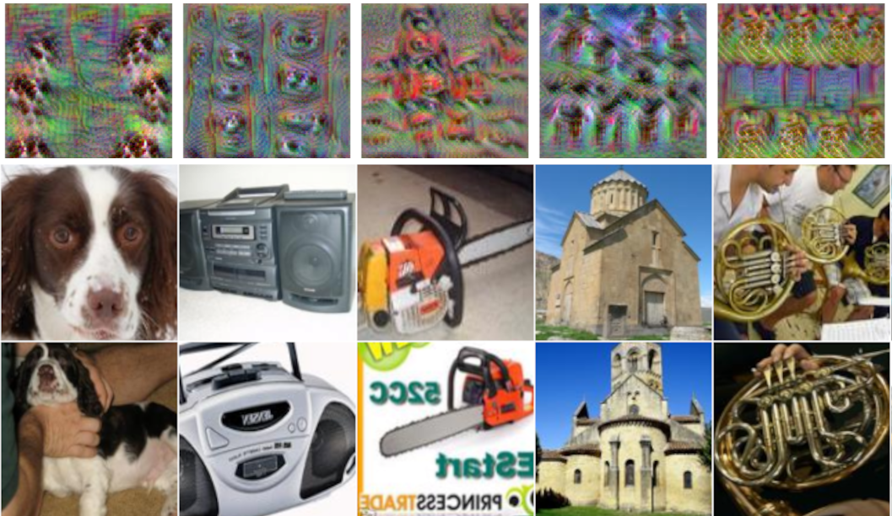
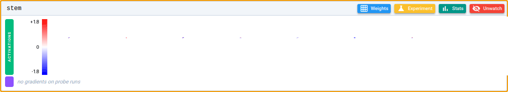
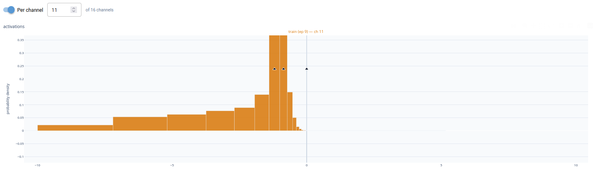
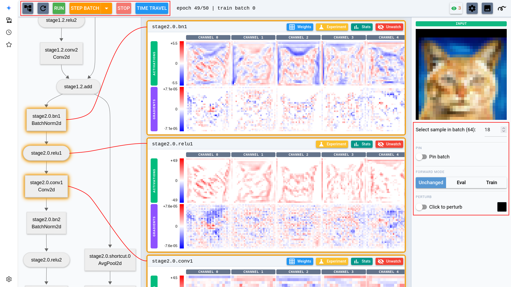

<h1 align="center">
   nansense
</h1>

<p align="center"><em>Don't guess why your neural network fails to learn. Instead, have a look inside.</em></p>



*Nansense* is a PyTorch debugger that visualizes activations, gradients, weights, optimizer state and various statistics. You can **pause, step batch-by-batch, and time-travel to a different epoch while training**, and see exactly what every layer is doing.

Here's how *nansense* can help:

- **Deepen your intuition** — [visualize activations and gradients](#visualize-activations-and-gradients-throughout-training), [find image patches with minimal or maximal activation for a given channel](#minmax-activation-patches) and [simulate what each neuron is searching for (deep dream)](#simulate-what-a-neuron-is-searching-for-deep-dream)
- **Spot optimization bottlenecks** — [discover insufficient receptive fields](#measure-receptive-field-of-a-neuron), [measure neuron death](#investigate-dead-neurons) and [discover padding artifacts](#padding-jump-target)
- **Investigate failure modes** — [spot gradient underflow](#spot-gradient-underflow)

You can easily try out the [examples](#run-examples) yourself. Or wire it into your own training loop. Adding nansense support is just a few lines of code. Here's an example for integrating with [raw PyTorch](#wire-it-into-your-loop-raw-pytorch) and with [Lightning](#wire-it-into-your-loop-pytorch-lightning).

## How is this different from wandb or TensorBoard?

Loggers like Weights & Biases and TensorBoard answer *what* your metrics did — they record scalar curves of loss and accuracy that you scroll through after the run. Nansense tries to answer *why*: it pauses inside the live training loop and lets you step batch-by-batch and time-travel while inspecting the activations, gradients, weights and optimizer state of every layer. You can even run experiments on the paused model — deep dream, or Captum attributions like Grad-CAM — to probe what a given neuron has learned.

Persisting all this data on disk is infeasible, as a single batch of activations and gradients can easily be several gigabytes. Nansense sidesteps that by pausing and inspecting the tensors on demand, instead of writing everything to disk.

## Showcase

### Visualize activations and gradients throughout training

A layer's activations (top row) and gradients (bottom row) for a single input. Here, an image of a paraglider passes through an intermediate batch normalization layer. Each column is a channel, drawn on a diverging red/blue scale. Step through training to watch what each channel responds to and how strong the backward signal reaching it is.



<a id="padding-jump-target"></a>

Here's another example: Activations of a CIFAR10 layer, with the augmented input shown at the far right. The augmentation zero-pads the image, and that hard border lights up as strong edge activations ringing every channel — an artifact baked in by the padding. Maybe use reflection padding next time?


### Min/max activation patches

For any channel, nansense collects the input patches that drove it to its strongest (and weakest) responses over an epoch. Reading off the gallery is the quickest way to tell what a specific neuron has learned to detect. Here, we have 5 examples (each column is a neuron/channel) of what causes it to fire maximally.



### Simulate what a neuron is searching for (deep dream)

Deep dream optimizes the input itself to maximally excite a chosen neuron, synthesizing the pattern it is looking for. Any layer can be visualized this way, but here we use the network's final output layer, where the result is easiest to interpret. On MNIST, it produces ghostly digits between 0 and 9.



Why do those numbers look so strange? Deep dream does not necessarily make the features realistic — it maximizes them. A good example is the number 4. There are many ways to read this digit out of the strokes of the image, which is why it excites the neuron more than a typical 4 would.

The next picture has 5 columns corresponding to 5 of the 10 output channels of the Imagenette dataset. Here, the top row shows the deep dream images, and two maximally activating patches have been added as the bottom rows for comparison.



### Measure receptive field of a neuron

To measure the receptive field of a neuron, *nansense* has support for perturbing a single pixel, and watching the diff between the original propagate through the neural network. Here's an animation of such a diff spreading through layers. In this case, most of the input size gets covered, which indicates that the network is reasonably strided and deep.



### Investigate dead neurons

*Nansense* can measure each channel's activation and gradient distribution over a full epoch. With this particular channel, the entire distribution is negative, so the ReLU clamps every value to zero — the neuron is dead and contributes nothing downstream.



### Spot gradient underflow

In low-precision training (fp16) a layer's gradients can collapse into the *subnormal* range — below the dtype's smallest normal value — where precision drains toward zero and the layer's learning quality quietly drops. *nansense* checks activations and gradients for NaNs, infinities and this subnormal/overflow band every few batches, and pauses with a warning banner once a meaningful share of a layer's gradient magnitude lands there — so you catch the issue.

## Run examples

The examples run with [uv](https://docs.astral.sh/uv/getting-started/installation), a fast Python package manager. `uv` does not pollute your other Python environments, and automatically installs the necessary packages when running a script.

```bash
# Install uv:
curl -LsSf https://astral.sh/uv/install.sh | sh
```

Pick the dependency group that matches your hardware and pass it as `--group`:

| Group | Hardware |
| --- | --- |
| `cpu` | No GPU — CPU-only, any platform |
| `cuda-legacy` | Older NVIDIA GPUs: Maxwell, Pascal, Volta (CUDA 12.6) |
| `cuda` | Current NVIDIA GPUs: Turing through Blackwell (CUDA 13.0) |
| `rocm` | AMD GPUs (ROCm 7.2) |

Then launch any example; the requirements, datasets and any pretrained networks are downloaded automatically, and the UI serves on `--nansense-port`.

```bash
# `examples/standard/main.py` is a good starting point for mnist, cifar10 and imagenette. Use `--dataset` and `--model` for different combinations.
uv run --group [group] examples/standard/main.py --nansense-port 8080

# More exotic, but harder to interpret tasks:
uv run --group [group] examples/game_of_life/main.py --nansense-port 8080
uv run --group [group] examples/audio_keywords/main.py --nansense-port 8080
uv run --group [group] examples/depth_make3d/main.py --nansense-port 8080
```

A focused browser tab opens automatically at the boxed URL it prints (open it yourself if your environment has no browser); training pauses on the first batch. Drive it from the top bar. See the [UI tutorial](#ui-tutorial) for more info.

If you hit out-of-memory errors, lower `--batch-size`. If training is slow and you have GPU VRAM left, increase `--batch-size`. Both memory and training speed can be improved with `--dtype bf16` (older GPUs don't support it).

## UI tutorial



When a session starts, nansense serves a web page and pauses on the first batch.
You drive the run from the top bar: **Step Batch** advances one batch, **Run**
runs to the end and then pauses, and **Stop** pauses a free-running session. The
dropdown next to Step Batch steps a whole epoch or up to a custom point.

**Time Travel** jumps back to the start of any cached epoch. It is enabled once
the training loop is wrapped in a [restorer](#wire-it-into-your-loop-raw-pytorch),
which checkpoints each epoch start to disk.

### Watching layers and viewing stats

The left pane shows the model as a clickable architecture graph. Click a node to
**watch** that layer: its activations and gradients appear as a card, and from
that point on every batch feeds them into running statistics. Watched views
refresh on every pause and, while training runs, on the cadence set under
*Update frequency* in the settings.

Watching slows down the training and consumes memory, so
it's generally better to watch only a number of layers at a
time. Open a watched layer's **stats view** for the deep dive:
a histogram of its activation and gradient values over the epoch (down to a
single channel), and a gallery of the input patches that drove each channel to
its most extreme responses. Its **Current batch** phase shows the last captured
batch's distribution for *any* layer, watched or not, and the top bar's stats
button pauses or resumes collection without hiding the cards.

### Running experiments

Each layer card has an **Experiment** button. On the experiment page, pick a
method — deep dream, or a Captum attribution (Grad-CAM, Neuron Gradient, Neuron
Integrated Gradients, Occlusion) — set its parameters, and run it on the layer.
Experiments run between batches, so training must be paused; results show one
card per input sample.

### Select visualization inputs

The right sidebar controls which input the layer views are computed from.
**Select sample in batch** picks which sample of the current batch to show. The
views follow the live training batch by default; **Pin** freezes the current
batch as a fixed input that nansense re-runs at every update, so you can watch
one input's activations evolve as training proceeds and across time travel, and
**Forward mode** (Unchanged / Eval / Train) sets how BatchNorm and dropout
behave on those re-runs.

**Perturb** lets you click pixels to edit the input; nansense re-runs the model
and the layer cards switch to the diff, so you can trace a single changed pixel
through the network.

### Recording videos

The settings dialog records any view to an MP4 — one frame per visualization
update, written under `nansense_recordings/`. Start a recording with a layer
watched or an experiment open, then save or discard it from the same dialog.

## Use the library

```bash
pip install nansense
```

> **Note:** Install your PyTorch build first (see
> [pytorch.org](https://pytorch.org/get-started/locally/)) so your CUDA / ROCm /
> CPU choice is preserved: nansense bundles `captum` for the experiment page's
> attribution methods, and captum needs torch ≥ 2.3, so a pre-existing torch
> keeps `pip` from pulling a default CPU build. `pip install lightning`
> additionally enables `nansense.lightning`. Runs on Python 3.10–3.14.

### Wire it into your loop: raw PyTorch

```python
import torch
import nansense

# Init model, optimizer, criterion, dataloaders
model = ...
optimizer = ...
criterion = ...
train_dl, val_dl = ...

# Setup UI — the schedule is discovered as you train (phase names and batch
# counts are learned from the loop below); no need to declare them up front.
session = nansense.start(model, optimizer=optimizer, port=8080, enabled=True)

# Time travel needs an epoch cache. `session.epochs(50)` iterates like
# `range(50)` but checkpoints each epoch start; wrap each iteration's body in
# `with session.restore_point():` so a UI-requested jump can unwind it and
# re-enter at a different epoch. Without this loop, training runs once through
# and the Time Travel button is disabled.
for epoch in session.epochs(50, cache_dir=".nansense_cache"):
    with session.restore_point():
        # Training batch iteration
        for inputs, targets in session.batches(train_dl, phase="train"):
            optimizer.zero_grad()  # keep zero_grad at the beginning of the batch
            loss = criterion(model(inputs), targets)  # as nansense reads .grad when
            loss.backward()  # the batch exits, so zeroing after step() would
            optimizer.step()  # leave the weight-gradient views empty.
        # Validation batch iteration ...

# Close the UI (the served page stays up for post-mortem browsing)
session.close()
```

See the [Python API](#python-api) for more information.

### Wire it into your loop: PyTorch Lightning

```python
import lightning as L
from nansense.lightning import NansenseCallback, fit_with_time_travel

# PyTorch Lightning modules
module = ...
datamodule = ...

# `model="net"` is the attribute path to the network inside your LightningModule, e.g. module.net
callback = NansenseCallback(port=8080, model="net", enabled=True)

# Time travel consumes the running fit, so the trainer comes from a factory:
# fit_with_time_travel builds a fresh Trainer for each jump-and-replay attempt.
trainer_factory = lambda: L.Trainer(max_epochs=50)
fit_with_time_travel(trainer_factory, module, datamodule=datamodule, callback=callback)
```

See the [Python API](#python-api) for more information.

### Python API

`nansense.start(model, ...)` creates the `Session` and, when `port=` is given,
serves the UI. The arguments worth knowing:

- `optimizer` (optional) — adds per-parameter optimizer state and live
  hyperparameters to the weights page.
- `scheduler` (optional) — lets time-travel checkpoints restore the LR schedule.
- `enabled` — `False` makes the session a near-zero-overhead no-op, so you can
  leave the wiring in place and switch the UI off with one flag.
- `port` / `host` / `open_browser` — serve the UI immediately (the banner and
  auto-opened tab are skipped if a concurrent session already holds the port);
  omit `port` and call `nansense.serve(session, port=...)` separately for finer
  control.
- `input_mean` / `input_std` — the input normalization, so images display in
  their original colors.

Iterate each phase with `session.batches(loader, phase=...)`, and call
`session.close()` when training finishes (the served page stays up for
post-mortem browsing). For time travel, drive the epoch loop with
`for epoch in session.epochs(N, cache_dir=...)` (default `.nansense_cache`) and
wrap each iteration's body in `with session.restore_point():` as shown above.

The schedule is discovered as you go: phase names and per-phase batch counts are
learned while you iterate `session.batches`, so the UI's per-phase progress and
boundary stops become exact after the first epoch. Pass `phases={"train": a,
"val": b}` to `start()` if you want that precision from the very first epoch — an
optional up-front declaration (it's what the PyTorch Lightning integration uses).

For **PyTorch Lightning**, attach a `NansenseCallback(model="<attr path to the
network>", ...)` to your trainer and run the fit through `fit_with_time_travel`,
which owns the jump-and-replay loop. Both accept the same `port` / `host` /
`open_browser` / `enabled` / `input_mean` / `input_std` arguments as `start`.

**Distributed (DDP)** needs no special wiring: call `nansense.start()` on every
rank (the DDP-wrapped model is unwrapped automatically). Rank 0 serves the UI and
drives pausing and stepping; the other ranks follow its pace and fold their data
shard into the watch-page statistics. Time travel works too — drive every rank's
epoch loop with `session.epochs()`. See `examples/standard/main.py --distributed`. Keep in mind that DDP support is currently **experimental**.

See [`INTERNALS.md`](INTERNALS.md) for how it works under the hood (it's long).
