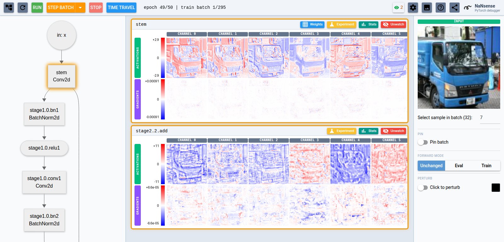

<h1 align="center">
   NaNsense
</h1>

<p align="center"><em>Don't guess why your neural network fails to learn. Instead, have a look inside.</em></p>

https://github.com/user-attachments/assets/b15f7dc5-1a6f-44d2-81fa-a97daafa89c6

<p align="center"><em>Cut from a real training run — one channel at four depths across every epoch, deep dream building a neuron's favourite picture out of noise, and a single changed input pixel spreading outwards to measure the receptive field.</em></p>

<p align="center">
  
</p>

<p align="center"><em>And where you do it: click a layer in the architecture graph to open its card — activations above, gradients below, one image per channel. The top bar steps batches and time-travels between epochs; the right pane chooses, pins and perturbs the input every view is computed from.</em></p>

- 🕹️ **[Try the Playground](https://kongaskristjan.github.io/nansense/dev/playground/)** — inspect a trained network in your browser, no install
- ✨ **[Integrate with one prompt](https://kongaskristjan.github.io/nansense/dev/integrate/)** — a coding agent wires it into your training loop
- 🤖 **[Debug with a coding agent](https://kongaskristjan.github.io/nansense/dev/mcp/)** — it speaks MCP, so your agent can also debug your net
- 📚 **[Documentation](https://kongaskristjan.github.io/nansense/)** — showcase, guides and the full Python API (also as [llms.txt](https://kongaskristjan.github.io/nansense/llms.txt))

*NaNsense* is a PyTorch debugger that visualizes activations, gradients, weights, optimizer state and various statistics. You can **pause, step batch-by-batch, and time-travel to a different epoch while training**, and see exactly what every layer is doing.

Here's how *NaNsense* can help:

- **See what is actually going on**. Visualize activations and gradients, find image patches with minimal or maximal activation for a given channel, and simulate what each neuron is searching for (deep dream)
- **Spot optimization bottlenecks**. Discover insufficient receptive fields, measure neuron death, discover padding artifacts and spot gradient underflow

Unlike wandb or TensorBoard, which log external metrics (loss, accuracy) to scroll through after the run, NaNsense is about understanding the internals of the network. A logger tells you *that* the loss stopped falling; NaNsense shows you *why* — say, a layer's channels dying or fp16 gradients underflowing.

## Try it

Clone the repository and run a bundled example with [uv](https://docs.astral.sh/uv/getting-started/installation) — Python, dependencies, datasets and pretrained networks download automatically, and a browser tab opens with the UI. The first run fetches all of that, so give it a few minutes; later runs start in seconds:

```bash
# Install uv (Windows: https://docs.astral.sh/uv/getting-started/installation):
curl -LsSf https://astral.sh/uv/install.sh | sh

git clone https://github.com/kongaskristjan/nansense
cd nansense

# --group: cpu (CPU or mac MPS acceleration) | cuda (NVIDIA) | cuda-legacy (pre-Turing NVIDIA) | rocm (AMD)
uv run --group cpu examples/standard/main.py --nansense-port 8080
```

[Getting started](https://kongaskristjan.github.io/nansense/dev/getting-started/) lists all the examples and explains the hardware groups.

## Use it in your project

```bash
pip install nansense
```

Wiring it into a training loop is a few lines of code: paste [one prompt](https://kongaskristjan.github.io/nansense/dev/integrate/) into your coding agent, or follow the [Wiring guide](https://kongaskristjan.github.io/nansense/dev/wiring/) yourself.

See [`INTERNALS.md`](INTERNALS.md) for how it works under the hood (it's long).
