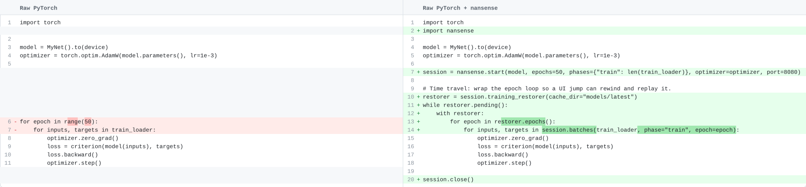
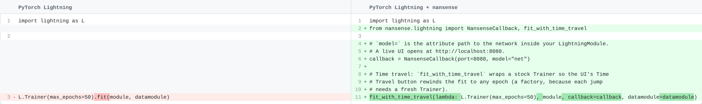

<p align="center">
  
</p>

<h1 align="center">nansense</h1>

<p align="center"><em>Don't guess why your neural network fails to learn. Instead, have a look inside.</em></p>

<!-- TODO: replace with a real showcase GIF (assets/showcase.gif): perturb a pixel,
     watch the diff ripple through the layers, then time-travel back an epoch. -->
<p align="center">
  
</p>

Hook one `Session` into your PyTorch loop and a web UI opens onto the running
model — activations, gradients, weights, and optimizer state, live as it
trains. **Pause, step batch-by-batch, and time-travel to a different epoch**, and see exactly what every layer is doing. Here's what you can do:

- **Deepen your intuition** — [investigate activations and gradients](), [find min/max activation patches]() and [simulate what a neuron is searching for]()
- **Spot optimization bottlenecks** — [discover insufficient receptive fields](), [measure neuron death]() and [fix augmentation ripple effects]()
- **Investigate failure modes** — [spot and investigate gradient underflow](), [record weight and optimizer dynamics to understand training instability]()

[Try out the pre-made examples]() or wire it into your own training loop. You're just a `pip install nansense` and a few lines of code away in [raw PyTorch]() or in [Lightning]().

## What you get

<!-- TBD -->

## Run examples

The examples run with [uv](https://docs.astral.sh/uv/getting-started/installation), a fast Python package manager. `uv` does not pollute your other Python environments, and automatically installs the necessary packages when running a script.

Sync the dependency group that matches your hardware:

```bash
# Install uv:
curl -LsSf https://astral.sh/uv/install.sh | sh
```

Then launch any example. The requirements, datasets and any pretrained networks are downloaded automatically. UI servs on `--nansense-port`.

```bash
# The `examples/standard/main.py` script is a good starting point for mnist, cifar10 and imagenette. Use `--dataset` and `--model` for different combinations.
uv run examples/standard/main.py --nansense-port 8080

# More exotic, but harder to interpret tasks:
uv run examples/game_of_life/main.py --nansense-port 8080
uv run examples/audio_keywords/main.py --nansense-port 8080
uv run examples/depth_make3d/main.py --nansense-port 8080
```

Open the printed URL; training pauses on the first batch. Drive it from the top bar.

If you hit out-of-memory errors, lower `--batch-size` (or pass `--dtype bf16`).

## Use the library

```bash
pip install nansense
```

Install your PyTorch build first (see
[pytorch.org](https://pytorch.org/get-started/locally/)) so your CUDA / ROCm /
CPU choice is preserved: nansense bundles `captum` for the experiment page's
attribution methods, and captum needs torch ≥ 2.3, so a pre-existing torch
keeps `pip` from pulling a default CPU build. `pip install lightning`
additionally enables `nansense.lightning`. Runs on Python 3.10–3.14.

### Wire it into your loop

It's a handful of lines either way — `start()`, wrap your loader, and wrap the
epoch loop in a restorer to opt into time travel.

<!-- These diff images are generated from the snippets in assets/code-examples/
     by `uv run assets/code-examples/render_diffs.py`. They are theme-aware SVGs
     (a single file adapts to light/dark); regenerate them after editing the
     snippets. -->

**Raw PyTorch**



**PyTorch Lightning** — your `LightningModule` is untouched; a callback drives
the UI and `fit_with_time_travel` wraps a stock `Trainer` so the Time Travel
button works (a factory, because each jump needs a fresh `Trainer`):



The full `start()` surface:

```python
session = nansense.start(
    model,
    epochs=50, phases={"train": N, "val": M},  # phases: {name: batch_count}
    optimizer=None, scheduler=None, # optional: optimizer-state view; scheduler restored on time travel
    input_mean=None, input_std=None,# optional: denormalize inputs for display
    port=8080,                      # serve the UI here (None = build session, don't serve)
    enabled=True,                   # enabled=False → near-zero-overhead no-op
)

for batch in session.batches(loader, phase="train", epoch=epoch): ...
session.close()
```

**Time travel** is opt-in: wrap the epoch loop in a restorer and the UI's
jump button comes alive.

```python
restorer = session.training_restorer(cache_dir="models/latest")
while restorer.pending():
    with restorer:                      # a UI jump unwinds here and replays
        for epoch in restorer.epochs():
            train_one_epoch(...); validate(...); scheduler.step()
```

**DDP** needs no special wiring: call `nansense.start()` on every rank (pass
the DDP-wrapped model — it's unwrapped automatically). Rank 0 serves the UI and
drives pausing; the other ranks fold their data shard into the watch-page
statistics, and a time-travel jump rewinds every rank in lockstep.

See [`INTERNALS.md`](INTERNALS.md) for how it works under the hood.
