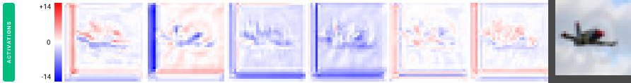
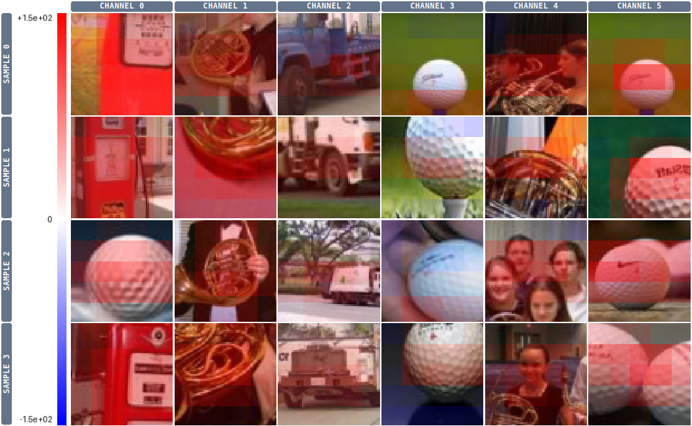
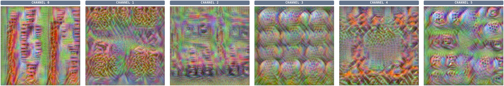
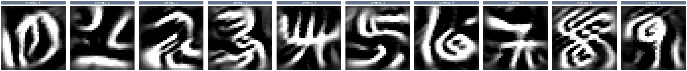

# nansense

*Don't guess why your neural network fails to learn. Instead, have a look inside.*

<video controls muted style="max-width: 100%;" src="https://github.com/user-attachments/assets/d7ee7ecc-4828-4655-866d-a220174c2b44"></video>

*Nansense* is a PyTorch debugger that visualizes activations, gradients, weights, optimizer state and various statistics. You can **pause, step batch-by-batch, and time-travel to a different epoch while training**, and see exactly what every layer is doing.

Here's how *nansense* can help:

- **See what is actually going on.** [Visualize activations and gradients](#visualize-activations-and-gradients-throughout-training), [find image patches with minimal or maximal activation for a given channel](#minmax-activation-patches) and [simulate what each neuron is searching for (deep dream)](#simulate-what-a-neuron-is-searching-for-deep-dream).
- **Spot optimization bottlenecks.** [Discover insufficient receptive fields](#measure-the-receptive-field-of-a-neuron), [measure neuron death](#investigate-dead-neurons), [discover padding artifacts](#padding-artifacts) and [spot gradient underflow](#spot-gradient-underflow).

Start with [Getting started](getting-started.md) to run an example in minutes, read the [UI guide](ui.md) for a tour of every page, and see the [Wiring guide](wiring.md) for adding nansense to your own training loop — it's just a few lines of code.

## How is this different from wandb or TensorBoard?

Loggers like Weights & Biases and TensorBoard record scalar curves of loss and accuracy that you scroll through after the run. Nansense works inside the live training loop instead: it pauses so you can step batch-by-batch and time-travel while inspecting the activations, gradients, weights and optimizer state of every layer. You can even run experiments like deep dream or Grad-CAM on the paused model to probe what a given neuron has learned.

Persisting all this data on disk is infeasible, as a single batch of activations and gradients can easily be several gigabytes. Nansense sidesteps that by pausing and inspecting the tensors on demand, instead of writing everything to disk.

## Showcase

### Visualize activations and gradients throughout training

A layer's activations (top row) and gradients (bottom row) for a single input. Each column is a channel, drawn on a diverging red/blue scale. Step through training to watch what each channel responds to and how strong the backward signal reaching it is.

*Figure 1. An intermediate layer's activations and gradient from an image of a golf ball. Each column is a separate channel. Due to the next layer being a ReLU, the gradient exists only where the activation is positive.*

### Padding artifacts

*Figure 2. Activations of a CIFAR10-trained network layer, with the input shown for comparison as the rightmost image. The augmentation used here zero-pads on the left and bottom of the image, which lights up as strong edge activations on every channel. Maybe use reflection padding next time?*

### Min/max activation patches

For any channel, nansense collects the input patches that drove it to its strongest (and weakest) responses over an epoch. Reading off the gallery is the quickest way to tell what a specific neuron has learned to detect.

*Figure 3. For each of the 6 first channels/neurons in a specific layer, the 4 strongest activating patches from the training set have been collected. The heatmap coloring shows the activation strength. Both `CHANNEL 1` and `CHANNEL 4` seem optimized for detecting french horns, however `CHANNEL 1` is more centered on the instrument itself, while `CHANNEL 4` also fires on human faces. See also Figure 4.*

### Simulate what a neuron is searching for (deep dream)

Deep dream optimizes the input itself to maximally excite a chosen neuron, synthesizing the pattern it is looking for.

*Figure 4. Deep dream on exactly the same channels/neurons that were used to select maximally activating patches in Figure 3. `CHANNEL 0` creates a lot of vertical red structures, loosely resembling a typical gas station. In `CHANNEL 1` we see yellowish curved structures, picked up from french horns. `3` and `5` have circular structures with dots inside, analogous to golf balls.*

Any layer can be visualized this way, but the network's final output layer is easiest to interpret. On MNIST, it produces ghostly digits between 0 and 9:

*Figure 5. Deep dream on the final layer of a lenet network on the MNIST dataset.*

Those numbers look strange because deep dream does not necessarily make the features realistic; it maximizes them. A good example is the number 4: there are many different ways you could combine these strokes into a 4, which is why it excites the neuron even more than a typical 4 would.

Here's a video visualizing other layers:

<video controls muted style="max-width: 100%;" src="https://github.com/user-attachments/assets/327e0f36-4b80-4c6f-8bd0-639606a9338b"></video>

### Measure the receptive field of a neuron

To measure the receptive field of a neuron, *nansense* can perturb a single pixel and show the diff between the original and perturbed activations as it propagates through the network.

*Figure 6. Here we perturb a single pixel of an image, and visualize how the perturbation transmits through the network. As we go deeper down the layers, the diff spreads throughout most of the image, which indicates a reasonably healthy receptive field (at least some part of the network can see the whole image).*

### Investigate dead neurons

*Nansense* can measure each channel's activation and gradient distribution over a full epoch. This makes it easy to discover optimization problems, such as some neurons being driven to zero.

*Figure 7. The activation histogram of a dead channel in a layer. Apparently all activations are negative, which causes the next ReLU layer to clamp everything to zero. Because this eliminates any gradients, the channel will likely never recover from this state.*

### Spot gradient underflow

In low-precision training (fp16) a layer's gradients can collapse into the *subnormal* range (below the dtype's smallest normal value) where precision drains toward zero and the layer's learning quality quietly drops. *Nansense* checks activations and gradients for NaNs, infinities and this subnormal/overflow band every few batches, and pauses with a warning banner once a meaningful share of a layer's gradient magnitude lands there.

## Under the hood

Curious how it works? The repository's [INTERNALS.md](https://github.com/kongaskristjan/nansense/blob/main/INTERNALS.md) is a deep dive into the threading model, capture hooks, time travel and the UI layer.
